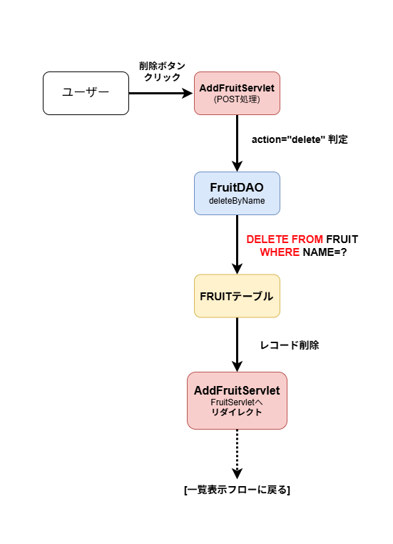

# 削除処理設計書

## 1. 概要
果物管理アプリの削除処理について記述する。削除は AddFruitServlet 内で action=delete を判定して実行する。処理完了後は一覧表示サーブレット（FruitServlet）へリダイレクトする。

---

## 2. 画面操作
- 一覧画面の「削除」ボタン押下
- 以下のパラメータが POST 送信される
  - action = delete
  - name = 削除対象の果物名

  ### 2-1. 処理フロー図

※ 画像をクリックすると拡大表示されます。

**色分け情報：**  
- Controller → 赤 
- Model → 青  
- SQLテーブル   →  黄

---

## 3. AddFruitServlet（POST処理）

### 3-1. action 判定
`action` が "delete" の場合、削除処理へ進む。

### 3-2. 削除対象名の取得
`String name = request.getParameter("name");`

### 3-3. DAO 呼び出し
`FruitDAO dao = new FruitDAO();`
`dao.deleteByName(name);`

---

## 4. FruitDAO.deleteByName

### 4-1. 概要
指定された果物名に一致するレコードを削除する。

### 4-2. SQL
`DELETE FROM FRUIT WHERE NAME = ?`

### 4-3. 処理内容
- PreparedStatement を使用して削除 SQL を実行
- 対象が存在しない場合は削除件数 0
- 正常終了後、呼び出し元へ戻る

---

## 5. FRUIT テーブル
削除対象は NAME に一致する行。

---

## 6. 削除後処理（リダイレクト）
削除完了後、一覧画面へ戻るため `response.sendRedirect("FruitServlet");` を実行する。

---
