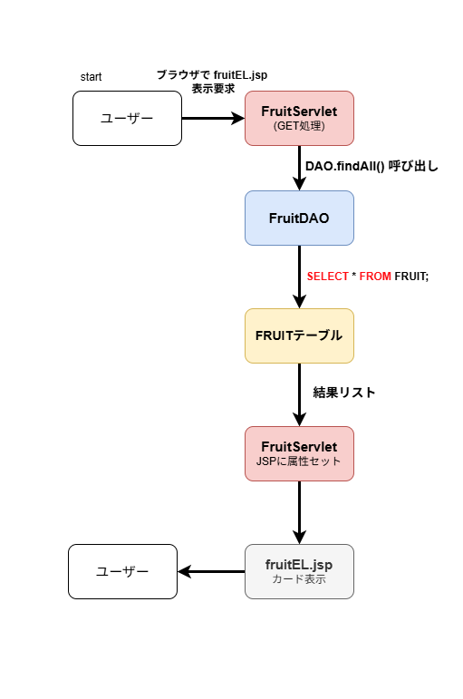

# 一覧表示処理設計書

## 1. 概要
果物管理アプリの一覧表示処理について記述する。  
ユーザーがブラウザで `fruitEL.jsp` を要求すると、FruitServlet が DB から全件取得して JSP に属性セットし、カード形式で表示する。

---

## 2. 処理フロー

### 2-1. ユーザー操作
- ブラウザで `fruitEL.jsp` 表示要求

### 2-2. FruitServlet（GET処理）
1. DAO 呼び出し：`List<Fruit> list = dao.findAll();`  
2. JSP 属性セット：`request.setAttribute("fruitList", list);`  
3. `request.getRequestDispatcher("fruitEL.jsp").forward(request, response);`

### 2-3. FruitDAO.findAll
- 概要：FRUIT テーブルの全件を取得  
- SQL：`SELECT * FROM FRUIT;`  
- 処理内容：
  - DB 接続  
  - SELECT 文実行  
  - 結果をリスト化して返却

---

## 3. FRUIT テーブル
- 表示対象は NAME, PRICE, DESC_TEXT, IMAGE を含む全レコード

---

## 4. fruitEL.jsp（カード表示）
- 属性 `fruitList` をループ処理  
- 各果物情報をカード形式で表示
  - NAME, PRICE, DESC_TEXT, IMAGE  
- ユーザーの画面上に一覧としてレンダリング

---

### 5. 処理フロー図

**色分け情報：**  
- Controller → 赤 
- Model → 青  
- View → グレー
- SQLテーブル   →  黄